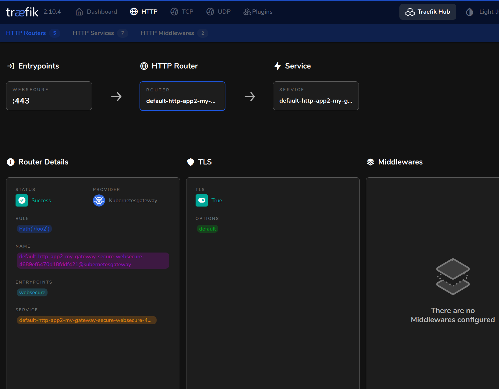
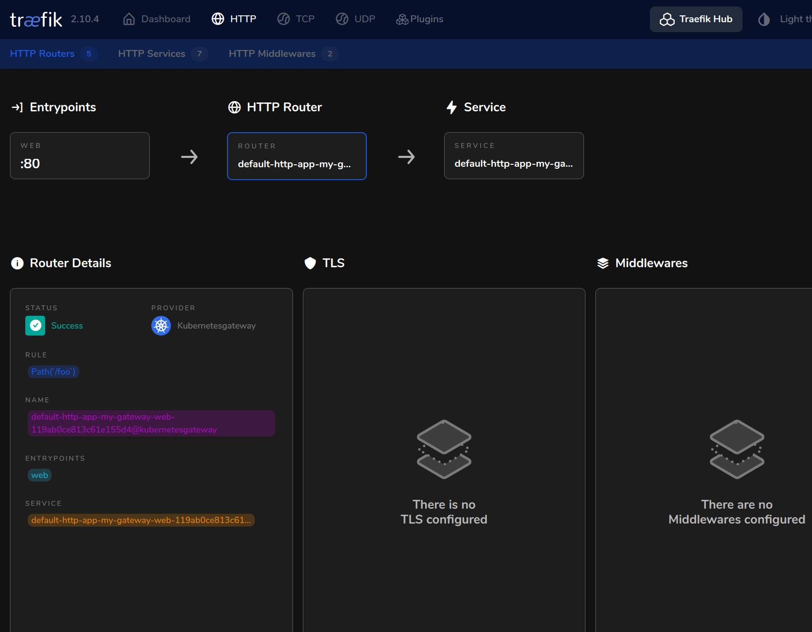
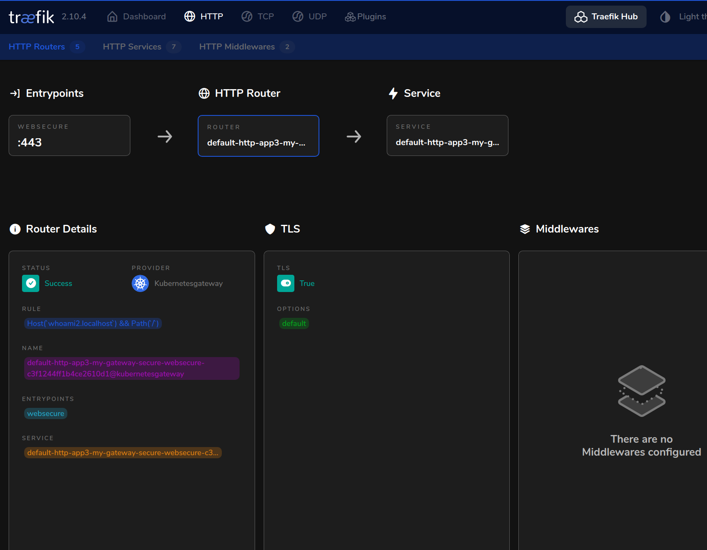

# `gateway api over traefik`


<h3>As of today `traefik` support `v0.4.0+` [gateway api](https://gateway-api.sigs.k8s.io/api-types/httproute/).</h3>

`traefik` port forwarding:

```
30000 on the host points to traefik's 80 (web)
30001 on the host points to traefik's 433 (websecure)
30002 on the host points to traefik's 433 (api)
```

<h3>whoami over https - self-signed certificates</h3>

```
curl -k https://whoami.localhost:30001/foo2
```
```yaml
apiVersion: gateway.networking.k8s.io/v1alpha2
kind: Gateway
metadata:
  name: my-gateway-secure <----- 
spec:
  gatewayClassName: my-gateway-class  
  listeners:
    - name: websecure
      protocol: HTTPS
      port: 443
      tls:
        certificateRefs:
          - kind: Secret
            name: mysecret
```

```yaml
apiVersion: gateway.networking.k8s.io/v1alpha2
kind: HTTPRoute
metadata:
  name: http-app2
  namespace: default
spec:
  parentRefs:
    - name: my-gateway-secure  <-----
  rules:
    - matches:
        - path:
            type: Exact
            value: /foo2
      backendRefs:
        - name: whoami
          port: 80
          weight: 1
```



<h3>whoami over http</h3>

```
curl http://whoami.localhost:30000/foo
```

```yaml
apiVersion: gateway.networking.k8s.io/v1alpha2
kind: Gateway
metadata:
  name: my-gateway
spec:
  gatewayClassName: my-gateway-class
  listeners:
    - name: web
      protocol: HTTP
      port: 80
```

```yaml
apiVersion: gateway.networking.k8s.io/v1alpha2
kind: HTTPRoute
metadata:
  name: http-app
  namespace: default
spec:
  parentRefs:
    - name: my-gateway
  rules:
    - matches:
        - path:
            type: Exact
            value: /foo
      backendRefs:
        - name: whoami
          port: 80
          weight: 1
```


<h3>whoami over http - custom domain</h3>

```
curl -k https://whoami2.localhost:30001
```
```yaml
apiVersion: gateway.networking.k8s.io/v1alpha2
kind: HTTPRoute
metadata:
  name: http-app3
  namespace: default
spec:
  parentRefs:
    - name: my-gateway-secure
  hostnames:
  - whoami2.localhost
  rules:
    - matches:
        - path:
            type: Exact
            value: /
      backendRefs:
        - name: whoami
          port: 80
          weight: 1
```




```
traefik dashboard
http://localhost:30002
```


