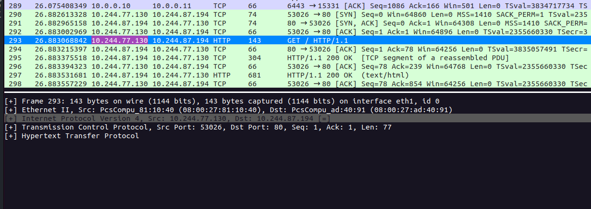

# Install Calico

Install CRD's 
```bash
kubectl create -f https://raw.githubusercontent.com/projectcalico/calico/v3.26.4/manifests/tigera-operator.yaml
```

We will start with VXLAN encapsulation, even for communication in the same subnet.

```yaml
kind: Installation
apiVersion: operator.tigera.io/v1
metadata:
  name: default
spec:		
calicoNetwork:
ipPools:
- cidr: 10.244.0.0/16
encapsulation: Always
```
Note: `Installation` will create default `IPPool`


Now let's switch to encapsulate only if communication cross the subnet, modify IPPool

```yaml
apiVersion: crd.projectcalico.org/v1
kind: IPPool
metadata:
  name: default-ipv4-ippool
spec:
  allowedUses:
  - Workload
  - Tunnel
  blockSize: 26
  cidr: 10.244.0.0/16
  ipipMode: Never
  natOutgoing: true
  nodeSelector: all()
  vxlanMode: CrossSubnet

```



There's no encapsulation for communication in the same subnet

Now let's enforce IPinIP

```yaml
apiVersion: crd.projectcalico.org/v1
kind: IPPool
metadata:
  name: default-ipv4-ippool
spec:
  allowedUses:
  - Workload
  - Tunnel
  blockSize: 26
  cidr: 10.244.0.0/16
  ipipMode: Always
  natOutgoing: true
  nodeSelector: all()
  vxlanMode: Never
```


And switch for IPinIP for only CrossSubnet mode

```yaml
apiVersion: crd.projectcalico.org/v1
kind: IPPool
metadata:
  name: default-ipv4-ippool
spec:
  allowedUses:
  - Workload
  - Tunnel
  blockSize: 26
  cidr: 10.244.0.0/16
  ipipMode: CrossSubnet
  natOutgoing: true
  nodeSelector: all()
  vxlanMode: Never
```

