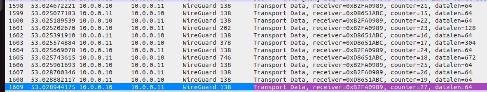

# Wireguard encryption with Calico
 `Calico`  makes it easy to encrypt on the wire in-cluster pod traffic in a  `Calico`  cluster using `WireGuard`. `WireGuard` utilizes state-of-the-art cryptography and aims to be faster, simpler, leaner, than alternative encryption techniques such as IPsec.

 `Calico`  handles all the configuration of `WireGuard` for you to provide full mesh encryption across all the nodes in your cluster.  `WireGuard` is included in the latest Linux kernel versions by default, and if running older Linux versions you can easily load it as a kernel module. (Note that if you have some nodes that don’t have `WireGuard` support, then traffic to/from those specific nodes will be unencrypted.)


Download `Calico Installation` resources:
```yaml
kubectl create -f https://raw.githubusercontent.com/projectcalico/calico/v3.26.4/manifests/tigera-operator.yaml
wget https://raw.githubusercontent.com/projectcalico/calico/v3.26.4/manifests/custom-resources.yaml
```

Modify pod CIDR (two methods)
1)
```yaml
sed -i 's/cidr: 192.168.0.0\/16/cidr: 10.244.0.0\/16/' custom-resources.yaml
kubectl apply -f custom-resources.yaml
```
2)
```yaml
kubectl apply -f custom-resources.yaml
kubectl patch installation default --type JSON --patch-file specific-files/patch.yml
```

Let's wait for Calico to spin up
```yaml
kubectl wait --for=condition=ready pod -l k8s-app=calico-apiserver -n calico-apiserver
```

Enable encryption:
```bash
kubectl patch felixconfiguration default --type='merge' -p '{"spec":{"wireguardEnabled":true}}'
```

Run server & client
```yaml
kubectl apply -f specific-files/clientserver.yml
```

Call server from client
```yaml
kubectl exec $(kubectl get pods --no-headers -o custom-columns=":metadata.name" -l app=client) -- curl server
```





